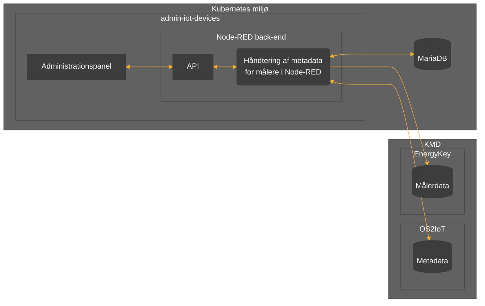

# admin-iot-devices `README.md`
[**Formål**](#formål) | [**Beskrivelse**](#beskrivelse) | [**Afhængigheder**](#afh%C3%A6ngigheder)

## Formål

Det primære formål med applikationen er at håndtere registrering samt overvågning af IoT-målere opsat i kommunale bygninger og institutioner via [OS2IoT](https://github.com/OS2iot). 

Herudover har applikationen til formål at konvertere og eksportere  målerdata til [KMD EnergyKey](https://www.kmd.dk/loesninger-og-services/loesninger/energi/kmd-energykey) jf. EnergyKey format EK109.

***OBS**: Målerdata lagres med sekundær applikation: [import-iot-data](https://github.com/Randers-Kommune-Digitalisering/import-iot-data).*

## Beskrivelse

### Håndtering af målere, målerskabeloner og målepunkter

Applikationen udstiller et web-baseret administrationspanel til at registrere, overvåge og håndtere målere, målerskabeloner og målepunkter.

**Målere** der registreres via applikationen lagres som metadata i SQL-database (MariaDB) og registreres derefter automatisk i OS2IoT via API. Applikationen håndterer ligeledes registrering af målerne på et specificeret OS2IoT data target.

Efter automatisk registrering af målere i OS2IoT, skubbes data fra målere til HTTP-endpoint udstillet af [import-iot-data](https://github.com/Randers-Kommune-Digitalisering/import-iot-data), som derefter håndterer lagring af målerdata fra registrerede målere.

**Målerskabeloner** er en redskab til nemt at registrere flere målere af samme type. Målere som er registreret med en skabelon nedarver målepunkter, energiart, dekoder og enhedsprofil fra skabelonen. 

**Målepunkter** kan registreres på både skabeloner og målere. Målepunkter peger på en bestemt type data som måles af enheden, som f.eks. `temperatur` eller `luftfugtighed` måles af en indeklimamåler. 

Data eksporteres automatisk fra registrerede målepunkter til KMD EnergyKey. Data eksporteres via SFTP én gang i timen, og metadata for seneste eksportering registreres for målepunkterne.

---
### Datatræk

Applikationen henter via GET-requests én gang dagligt nye payload decoders fra OS2Iot API som er registeret med `Randers [2]` i navnet.

Ligeledes hentes enhedsprofiler (device profiles) med specificeret organisations-id én gang dagligt.

**OBS**: Enhedsprofiler er skjulte i nuværende version, da denne kun understøtter registrering med `Lora 1.0.3 OTAA Class A`. Vær derfor opmærksom på at enhedsprofil pt. er prædefineret med UID.

---
### API
Applikationen udstiller et API som overholder NGSIv2 standarder for IoT-metadata. API'et benyttes af administrationspanelet til at håndtere applikationsdata, men kan også tilgås manuelt eller af andet system.

#### API'et udstiller blandt andet følgende endpoints under URL'en `/api/`

|Endpoint| Beskrivelse |
|--|--|
| [GET] devices | Liste over alle registrerede skabeloner og enheder |
| [GET] devices/*{{uid}}* | Metadata for måler med uid *{{uid}}* |
| [PUT] devices/*{{uid}}* | Redigér skabelon eller enhed med uid *{{uid}}* |
| [POST] devices | Registrer ny skabelon eller enhed |
| [GET] devices/*{{uid}}*/dimensions | Datatyper målt af enhed *{{uid}}* |
| [GET] devices/*{{uid}}*/measurements | Liste over alle registerede målepunkter for enhed med uid *{{uid}}*
| [POST] devices/*{{uid}}*/measurements | Registrer nyt målepunkt på enhed med uid *{{uid}}* |
| [PUT] measurements/*{{uid}}* | Redigér målepunkt med uid *{{uid}}* |
| [GET] measurements/*{{uid}}* | Metadata for målepunkt med uid *{{uid}}* |
| [GET] measurements/*{{uid}}*/now | Seneste datapunkt for målepunkt med uid *{{uid}}* |
| [GET] measurements/*{{uid}}*/data | Datapunkter siden seneste dataeksport *{{uid}}* |
| [GET] decoders | Payload decoders |
| [GET] deviceprofiles| Enhedsprofiler |

## Afhængigheder

:gear: | [Vue 3.3.4](https://vuejs.org), [Express.js 4.18.2](https://expressjs.com) (+`cors`, +`http-proxy-middleware`), [Vite 4.4.9](https://github.com/vitejs), [Axios 1.5.1](https://axios-http.com), [Node.js 18](https://docs.npmjs.com/downloading-and-installing-node-js-and-npm),  [Node-RED 3.0.2](https://nodered.org/docs/getting-started/windows), Node-RED modul: `node-red-mysql-r2`

:cloud: | Adgang til applikationens administrationspanel

:heavy_dollar_sign: | Miljøvariabler for database: 	`DB_HOST`, `DB_PORT`, `DB_DATABASE`, `DB_USER`, `DB_PASS`, for OS2IoT API: `OS2IOT_API_KEY`, samt for eksportering til SFTP-server: `SFTP_USER`, `SFTP_PASS`
